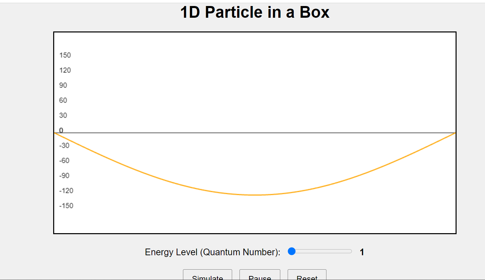

### Procedure is as follows 
Step 1: Set up the simulation with the default quantum number by adjusting the slider 
Step 2: Click the simulate button to see the visualisations 
 
 
Step3: Start the timer and set it for 30 sec and count the oscillations for each energy level. 
Step 4: Fill this table given below for each value of n (energy state) 
Step5: Plot the graph between n and no of oscillations seen in the given time (30sec). 
Step6: Write down the inference after plotting the graph 
<table style="width:100%">
<tr>
<th style="width:0.5%" >n(Quantum Number)</th>
<th style="width:20%">Timer Value</th>
<th style="width:20%">No of oscillations in the given time</th>	
<th style="width:20%">No. of waves seen</th>
</tr>
<tr>
<th>1</th>
<th>30</th>
<th></th>
<th></th>
</tr>
<tr>
<th>2</th>
<th>30</th>
<th></th>
<th></th>
</tr>
<tr>
<th>3</th>
<th>30</th>
<th></th>
<th></th>
</tr>
<th>4</th>
<th>30</th>
<th></th>
<th></th>
</tr>
</tr>
<th>5</th>
<th>30</th>
<th></th>
<th></th>
</tr>
</tr>
<th>6</th>
<th>30</th>
<th></th>
<th></th>
</tr>
</tr>
<th>7</th>
<th>30</th>
<th></th>
<th></th>
</tr>
</tr>
<th>8</th>
<th>30</th>
<th></th>
<th></th>
</tr>
</tr>
<th>9</th>
<th>30</th>
<th></th>
<th></th>
</tr>
</tr>
<th>10</th>
<th>30</th>
<th></th>
<th></th>
</tr>
</table>

