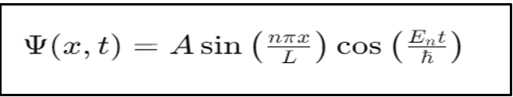
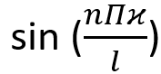
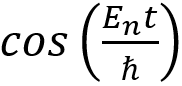

### Read the theory as follows:
In quantum mechanics, the behavior of particles confined to a one-dimensional box can be analyzed using the Schrödinger equation. This experiment provides a visual simulation of a particle's wavefunction in a 1D box using the time-dependent Schrödinger equation.
In our experiment, we aim to demonstrate how the oscillation of a wavefunction varies with changes in the energy level for a given time. By adjusting the quantum number and observing the resulting wavefunction, students can explore fundamental concepts in quantum mechanics, including wavefunctions, energy levels, and time evolution. The experiment helps visualize the relationship between the quantum number, which determines the energy level, and the oscillatory behavior of the wavefunction over time. 
## Schrödinger Equation and Wave Functions: 
 
The behavior of particles in the presence of a potential barrier is described by the time-independent Schrödinger equation: 
Where: 
	ℏ is the Plank constant, 
	En represents the energy corresponding to the quantum number n. 
	n is the quantum number, indicating the energy level. 
	L is the length of the box. 
	A is the amplitude of the box. 
	Ψ (x,t ) is the wavefunction of the particle as a function of position x and time t 
The wavefunction Ψ(x,t) combines: 
1. Spatial component: , which describes the distribution of the wavefunction within the box.
2. Time component:  , which describes how the wavefunction evolves over time.

